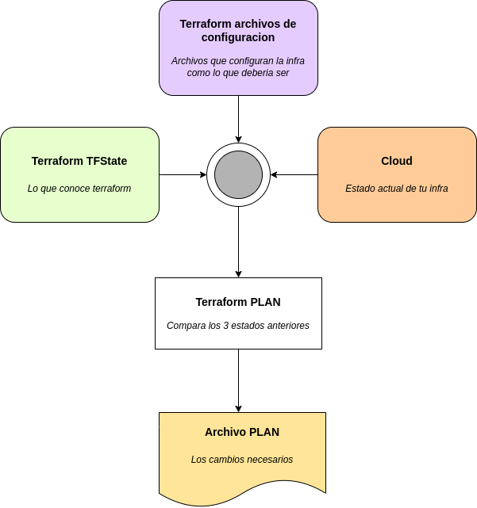

# secret-api
secret-api


## Terraform
Tres pasos del workflow:
1. init
2. plan
3. apply

### Init

`terraform init` crea un lock llamado terraform.lock.hcl e inicializando el archivo de backend, plugins, etc...

### Plan

Compara los archivos de configuracion, el terraform tfstate, y el actual estado del cloud. Esquema:



Usando el -o(output) generamos el archivo
```
terraform plan --out tfplan.bin
```

### Apply

Ultimo paso, aplicar

con `-auto-approve` elimina la necesidad de interaccion, no es recomendable. 

Si se utiliza en entornos de automatizacion, usar el `apply` sobre merges/pull-request manuales.

Listado de operaciones que se realizaran `Plan: 2 to add, 5 to change, 4 to destroy.`:
- Add: los nuevos recursos que se añadiran a tu infra
- Change: recursos existentes que cambiaran en tu infra
- Destroy: recursos existentes que se borraran en tu infra
